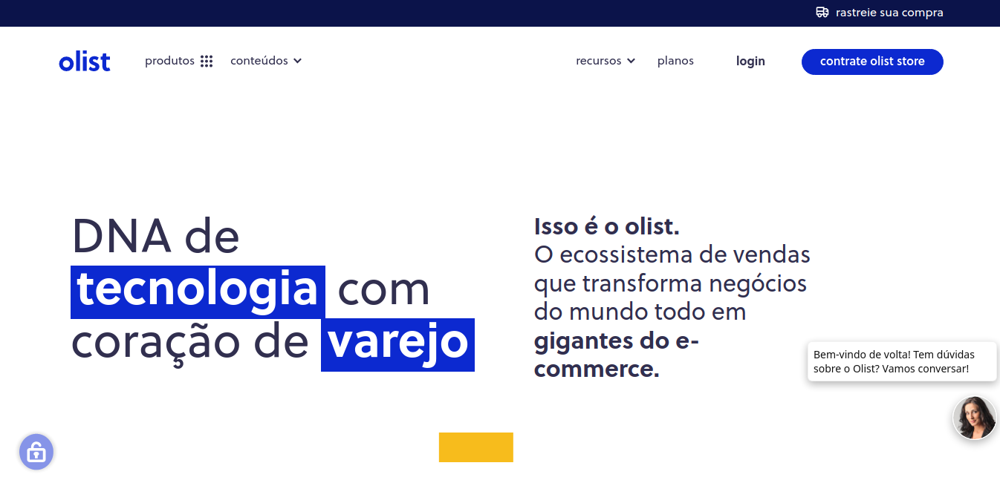

# Projeto SQL Olist Ecommerce

# 
🇺🇸 [English Version](https://github.com/deivison1983/olist_ecommerce_sql_project/blob/main/english_version/README_eng.md)

## O projeto

Este projeto que compõe o meu portfólio profissional busca coletar e analisar informações com as ferramentas da linguagem SQL no conjunto de dados disponibilizado pela empresa Olist. Convém mencionar que o conjunto de dados possui cerca de 100 mil pedidos realizados em vários sites de e-commerce do Brasil.

O projeto está estruturado nos seguintes passos:

1. Questão de negócio
2. Premissas do projeto
3. Planejamento da solução
4. Análise e resultados obtidos
5. Conclusão do projeto
6. Próximos passos

## 1 Questão de negócio

A empresa [Olist](https://olist.com/pt-br/) é uma empresa de tecnologia brasileira que atua no setor de varejo auxiliando estabelecimentos comerciais e comerciantes a venderem os seus produtos em marketplaces no Brasil. A proposta da empresa é facilitar que os comerciantes possam vender em qualquer lugar da internet de forma simples. A Olist conecta pequenas empresas a canais de venda sem complicações e com um único contato.

Os estabelecimentos comerciais e comerciantes que desejam vender on-line por meio de marketplaces precisam cadastrar os seus produtos nas diversas plataforma de e-commerce disponível no Brasil. Sendo assim, a mesma mercadoria precisa ser cadastrada de forma repetida, o que dificulta a operação e torna o processo demorado e sujeito a erros. Para resolver esse problema e facilitar o cadastro dos produtos em diferentes portais de venda, a Olist desenvolveu um serviço que faz todo esse processo automaticamente, permitindo que o estabelecimento/comerciante realize o cadastro da mercadoria uma unica vez e em um único site.

Além do serviço de cadastro dos produtos a Olist também reporta quando um cliente realiza a compra de um produto notificando estabelecimento/comerciante para atender o pedido que foi feito em um dos marketplaces. Assim que o cliente recebe o produto, ou vence a data prevista de entrega, o mesmo recebe uma pesquisa de satisfação por e-mail, no qual pode avaliar a experiência de compra, além de registrar observações e comentários.

Durante esse processo todas as informações sobre o estabelecimento comercial, o produto, o cliente, o meio de pagamento, as avaliações e o pedido realizado são armazenados em um banco de dados da Olist. Dentro do contexto da ciência de dados essas informações podem ser utilizada como uma importante fonte de dados para resolução de problemas de negócios. O projeto busca coletar e analisar informações com as ferramentas da linguagem SQL no conjunto de dados disponibilizado pela empresa Olist que se encontram localizados no endereço: https://www.kaggle.com/datasets/olistbr/brazilian-ecommerce

### 1.1 Qual o problema de negócio?
Os gerentes da empresa acreditam que há muitas informações valiosas armazenas nos dados, que ainda não foram exploradas. Diante disso, os mesmos desejam explorar e encontrar respostas para validar ou refutar novas hipóteses de negócio. Além disso, o time de dados da empresa está sobrecarregado com os projetos em andamentos e assim fui contratado como Cientista de Dados para explorar os dados e trazer repostas sobre o que realmente está acontecendo com o negócio. Semanalmente, todas as segundas-feira, preciso enviar as respostas de algumas perguntas feitas pelos gerentes.

### 1.2 O conjunto de dados
O conjunto de dados do projeto corresponde ao "Brazilian E-Commerce Public Dataset by Olist" existente na plataforma do Kaggle Inc. Ressalta-se que esse dataset tem informações de 100 mil pedidos de 2016 a 2018 realizados em vários marketplaces no Brasil. Segundo quem deu publicidade ao dataset, os dados comerciais são reais e foram anonimizados. Acrescenta-se que as suas funcionalidades permitem visualizar um pedido a partir de múltiplas dimensões: desde o status do pedido, preço do produto, dados de geolocalização, meio de pagamento, atributos do produto e, finalmente, avaliações escritas pelos clientes.

## 2 Premissas do projeto

Este é um projeto de estudo e não possui nenhuma finalidade comercial, sendo desenvolvido com base nos conhecimentos do autor sobre a linguagem SQL aplicado em um banco de dados SQLite.

## 3 Planejamento da solução

### 3.1 Produto proposto

As perguntas do time de negócios enviadas semanalmente serão respondidas por meio das consultas ao banco de dados SQLite com a ferramenta multiplataforma IDE DBeaver. Será entregue para cada semana um [relatório](https://github.com/deivison1983/olist_ecommerce_sql_project/tree/main/relatorios) em um notebook, arquivo.ipynb, onde demostro as perguntas, as queries correspondentes e o resultados das consultas para cada pergunta.

### 3.2 Ferramentas utilizadas

* SQLite
* DBeaver
* Jupyter Notebook

<table>
  <tbody>
    <tr valign="top">
      <td width="25%" align="center">
        SQLite  
        
      </td>
      <td width="25%" align="center">
        DBeaver  
        
      </td>
      <td width="25%" align="center">
        Jupyter  
        
      </td>
    </tr>
  </tbody>
</table>

### 3.3 Processo

Ao todo a execução da solução do projeto será dividida em 7 passos:

1. Recebimento das perguntas enviadas pelo time de negócios
2. Consultando e respondendo as perguntas
3. Execução dos relatórios
4. Disponibilização dos relatórios para o time de negócio

## 4 Análise e resultados obtidos

[Relatório Semana 1](https://github.com/deivison1983/olist_ecommerce_sql_project/blob/main/relatorios/projeto_olist_week_1_por_v1.ipynb)

[Relatório Semana 2](https://github.com/deivison1983/olist_ecommerce_sql_project/blob/main/relatorios/projeto_olist_week_2_por_v1.ipynb)

[Relatório Semana 3](https://github.com/deivison1983/olist_ecommerce_sql_project/blob/main/relatorios/projeto_olist_week_3_por_v1.ipynb)

[Relatório Semana 4](https://github.com/deivison1983/olist_ecommerce_sql_project/blob/main/relatorios/projeto_olist_week_4_por_v1.ipynb)

[Relatório Semana 5](https://github.com/deivison1983/olist_ecommerce_sql_project/blob/main/relatorios/projeto_olist_week_5_por_v1.ipynb)

[Relatório Semana 6](https://github.com/deivison1983/olist_ecommerce_sql_project/blob/main/relatorios/projeto_olist_week_6_por_v1.ipynb)

[Relatório Semana 7](https://github.com/deivison1983/olist_ecommerce_sql_project/blob/main/relatorios/projeto_olist_week_7_por_v1.ipynb)

## 5. Conclusão do projeto

O presente projeto cumpriu o seus objetivos e após todo o desenvolvimento foi possível responder as perguntas de negócio consultando o banco de dados disponibilizado pela empresa Olist. As perguntas foram respondidas. Além disso, os notebooks com todo processo de construção da solução também encontram-se disponíveis no presente repositório. Vale mencionar que o emprego da linguagem SQL para consultar banco de dados relacionais são fundamentais no contexto de resolução de problemas de negócio envolvendo ciência de dados.

## 6. Próximos passos

Ressalta-se que após a finalização desse projeto de estudo é possível seguir por vários caminhos distintos.Geralmente essa decisão poderá ser pautada por novas demandas vinda do CEO ou em função da motivação da equipe de ciencia de dados. Essa decisão se dá em função dos vários tipos de análises que podem ser realizadas com os dados, entre as quais destacamos:

* Realizar uma análise exploratória de dados (EDA).
* Projetos de Clusterização.
* Projeto de previsão de vendas.
* Análise de cohort para retenção de clientes.
* Construir análises de tendências.

### Autor

Deivison Morais. Visite o meu portfólio de projetos [aqui.](https://deivison1983.github.io/portfolio_projetos/)

### Contatos

  
  

