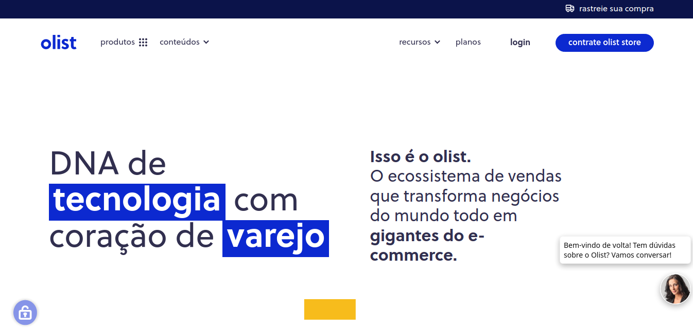

# SQL Olist Ecommerce Project

# 
🇧🇷 [Versão em Português](https://github.com/deivison1983/olist_ecommerce_sql_project)

## The project

This project seeks to collect and analyze information with SQL language tools in the data set provided by the company Olist. It is worth mentioning that the dataset has around 100,000 orders placed on various e-commerce sites in Brazil.

The project is structured in the following steps:

1. Business question
2. Project Assumptions
3. Solution planning
4. Analysis and results obtained
5. Project completion
6. Next steps

## 1 Business question

The company [Olist](https://olist.com/pt-br/) is a Brazilian technology company that operates in the retail sector helping commercial establishments and merchants to sell their products on marketplaces in Brazil. The company's proposal is to make it easy for merchants to sell anywhere on the internet in a simple way. Olist connects small businesses to sales channels seamlessly and with a single contact.

Commercial establishments and merchants who wish to sell online through marketplaces need to register their products on the various e-commerce platforms available in Brazil. Therefore, the same goods need to be registered repeatedly, which makes the operation difficult and makes the process time-consuming and subject to errors. To solve this problem and facilitate the registration of products in different sales portals, Olist developed a service that does this entire process automatically, allowing the establishment/merchant to register the goods only once and on a single site.

In addition to the product registration service, Olist also reports when a customer purchases a product by notifying the establishment/merchant to fulfill the order that was placed in one of the marketplaces. As soon as the customer receives the product, or the expected delivery date expires, he receives a satisfaction survey by email, in which he can evaluate the shopping experience, in addition to recording observations and comments.

During this process, all information about the merchant, product, customer, payment method, reviews and the order placed are stored in an Olist database. Within the context of data science this information can be used as an important source of data for solving business problems. The project seeks to collect and analyze information with SQL language tools in the dataset provided by the company Olist that are located at: https://www.kaggle.com/datasets/olistbr/brazilian-ecommerce

### What is the business problem?
Company managers believe that there is a lot of valuable information stored in the data that has not yet been explored. Given this, they want to explore and find answers to validate or refute new business hypotheses. In addition, the company's data team is overloaded with projects in progress and so I was hired as a Data Scientist to explore the data and bring answers about what is really happening with the business. Weekly, every Monday, I need to send the answers to some questions asked by the managers.

### 1.2 The dataset
The project dataset corresponds to the "Brazilian E-Commerce Public Dataset by Olist" existing on the Kaggle Inc platform. It is noteworthy that this dataset has information on 100,000 orders from 2016 to 2018 carried out in various marketplaces in Brazil. According to those who publicized the dataset, the commercial data is real and has been anonymized. In addition, its features allow viewing an order from multiple dimensions: from the order status, product price, geolocation data, payment method, product attributes and, finally, reviews written by customers.

## 2 Project assumptions

This is a study project and has no commercial purpose, being developed based on the author's knowledge of the SQL language applied in an SQLite database.

## 3 Solution planning

### 3.1 Proposed product

The business team's questions sent weekly will be answered through queries to the SQLite database with the IDE DBeaver cross-platform tool. A report will be delivered for each week in a notebook, file.ipynb, where I show the questions, the corresponding queries and the results of the queries for each question.

### 3.2 Tools used in this project

* SQLite
* DBeaver
* Jupyter Notebook

<table>
  <tbody>
    <tr valign="top">
      <td width="25%" align="center">
        SQlite  
        
      </td>
      <td width="25%" align="center">
        DBeaver  
        
      </td>
      <td width="25%" align="center">
        Jupyter  
        
      </td>
    </tr>
  </tbody>
</table>

### 3.3 Process

In all, the execution of the project solution will be splited into 7 steps:

1. Receipt of questions sent by the business team
2. Querying and answering questions
3. Execution of reports
4. Availability of reports for the business team

## 4 Analysis and results obtained

[Week Report 1](https://github.com/deivison1983/olist_ecommerce_sql_project/blob/main/relatorios/projeto_olist_week_1_por_v1.ipynb)

[Week Report 2](https://github.com/deivison1983/olist_ecommerce_sql_project/blob/main/relatorios/projeto_olist_week_2_por_v1.ipynb)

[Week Report 3](https://github.com/deivison1983/olist_ecommerce_sql_project/blob/main/relatorios/projeto_olist_week_3_por_v1.ipynb)

[Week Report 4](https://github.com/deivison1983/olist_ecommerce_sql_project/blob/main/relatorios/projeto_olist_week_4_por_v1.ipynb)

[Week Report 5](https://github.com/deivison1983/olist_ecommerce_sql_project/blob/main/relatorios/projeto_olist_week_5_por_v1.ipynb)

## 5. Project completion

The present project fulfilled its objectives and after all the development it was possible to answer the business questions by consulting the database provided by the company Olist. The questions have been answered. In addition, notebooks with the entire solution construction process are also available in this repository. It is worth mentioning that the use of the SQL language to query relational databases is fundamental in the context of solving business problems involving data science.

## 6. Next steps

It should be noted that after completing this study project, it is possible to follow several different paths. Generally, this decision may be guided by new demands coming from the CEO or depending on the motivation of the data science team. This decision is based on the various types of analysis that can be performed with the data, among which we highlight:

* Conduct an exploratory data analysis (EDA).
* Clustering Projects.
* Sales forecast project.
* Cohort analysis for customer retention.
* Build trend analysis

### Author

Deivison Morais. Visit my portfolio [here.](https://deivison1983.github.io/portfolio_projetos/)

### Contacts

  
  

